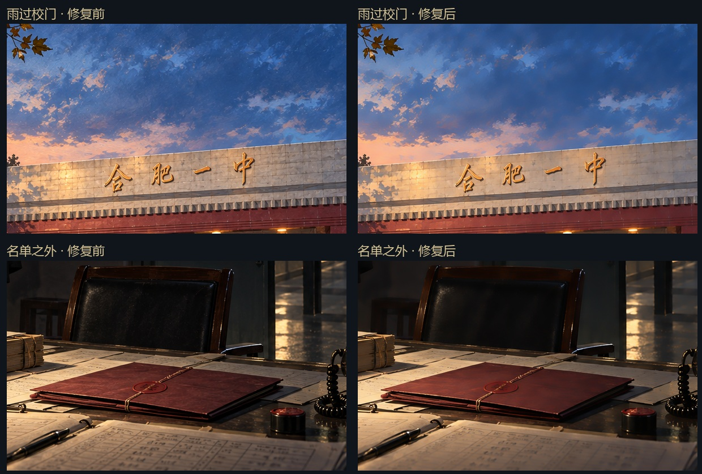

# AI CG 表面质量修复 · 2026-10-10

本次处理此前由 image_gen 生成的全部 **20 幅 CG**：2026-10-09 的2幅校园图与2026-10-10的18幅扩充图。PNG源图和游戏使用的WebP均已更新。原有22幅作者提供的CG保持原文件；图库共42幅，收藏条件和载入抽取规则保持既有设置。

## 方法与实际限制

已安装并使用 [repair-ai-image-quality](https://github.com/linsahdkadsa/repair-ai-image-quality)（MIT）。该工具的16项自检全部通过，学习模型可正常运行。

默认检测对20幅图全部给出跳过：其迷宫纹分数均低于GPT识别门槛0.02。这批画作的主要问题是生成提示词带来的过重画布笔触、颗粒和暗部细纹，不能把默认跳过当成已完成修复。

先试修「雨过校门」「名单之外」，检查200%局部后，使用工具的 `unet` 学习滤波器，强度40、明确开启 `force`。这里的 `presence_fraction=1.0` 表示全画面尝试低强度修复，**不代表工具检测到100%的画面存在迷宫纹**。随后用额外的、保护轮廓的双边亮度滤波减轻粗绘画细纹：强度0.85、颜色距离20、空间距离5，强建筑/人物边缘降低处理量。

两步均在原分辨率进行，没有重新生成人物、移动建筑、裁切或放大；没有另做全局调色。依次检查20幅画作的原图/修复图及局部总览，保留云层、树叶、雨水反光、墙缝、衣褶和纸张轮廓，让天空、墙面、皮椅及暗部更干净，仍保有绘画风格。

## 实测结果

- 全部20幅为1672×941，处理前后尺寸一致。
- 平缓区域的高频亮度细纹RMS平均下降 **23.1%**，逐图范围 **10.9%～37.3%**。
- 物体尺度的强边缘相关系数最低 **0.997449**。这是轮廓梯度的相关程度，不是“保留了99.7%的像素”。
- 以上RMS仅测量梯度较低的55%像素中的高频亮度，不等同于全图噪声量或画质评分；粗笔触和真实物体纹理仍有保留。

工具本身的示例指标：

| 画作 | 迷宫频谱凸起，修复前→后 | presence_fraction | 方法 | 工具边缘相关系数 | 组合处理后的平缓区细纹RMS下降 |
| --- | --- | --- | --- | --- | --- |
| 雨过校门 | 5.84→5.79 | 1.0（强制全画面） | unet | 1.0 | 14.53% |
| 名单之外 | 3.52→2.60 | 1.0（强制全画面） | unet | 1.0 | 36.09% |
| 保温杯与红批 | 12.22→7.61 | 1.0（强制全画面） | unet | 1.0 | 28.27% |

迷宫频谱指标只来自极少量符合该工具频谱形状的局部，不适合用作这些绘画的主要质量标准。完整逐图检测、学习滤波与额外清理指标、模型/源图/结果/WebP的SHA256见 [quality-repair-report.json](quality-repair-report.json)。

### 局部对比：左为原图，右为修复



## 后续制作与复现

新增CG提示词优先使用「干净的表面、细致线条、克制笔触、平滑光影过渡」，避免反复叠加 `tactile brush texture`、`rich textured brushwork`、画布颗粒等要求。生成后先检查原尺寸下的天空、墙面、皮肤、暗部，再决定是否需要处理，不能无差别强制清理照片和已有干净素材。

项目保存了离线辅助脚本 `scripts/repair_generated_cgs.py`。使用已安装skill的私有Python环境执行，输入文件保持原样，输出结果和对比图到单独目录。示例（在项目根目录）：

```powershell
$cgRepairSkill = Join-Path $env:USERPROFILE '.codex/skills/repair-ai-image-quality'
& "$cgRepairSkill/runtime/Scripts/python.exe" scripts/repair_generated_cgs.py `
  '.writing-work/cg-repair/original/雨过校门.png' `
  --skill-dir $cgRepairSkill --out-dir '.writing-work/cg-repair/recheck'
```

需人工审查后才替换源图，并运行 `scripts/build_loading_art.py` 生成网页版本。该修图环境只供开发离线使用，Cloudflare构建和玩家浏览器不需要Python、OpenCV或模型文件。

本次原图在本机 `.writing-work/cg-repair/original/` 保留；Git原图版本为 `e3fc4cd`。每幅完整对比图在 `.writing-work/cg-repair/final/`。再次修复应从这些原图开始，避免反复磨平。

## 游戏验证

399个本地素材引用、类型检查、回归测试与生产构建全部通过。生产包355个文件，最大文件7.57MiB，总计118.6MiB。独立浏览器成功解码全部42幅CG，核对20幅修复WebP的实际下载SHA256与报告一致；初始7幅风景收藏、桌面与小屏美术室正常，无浏览器错误。
