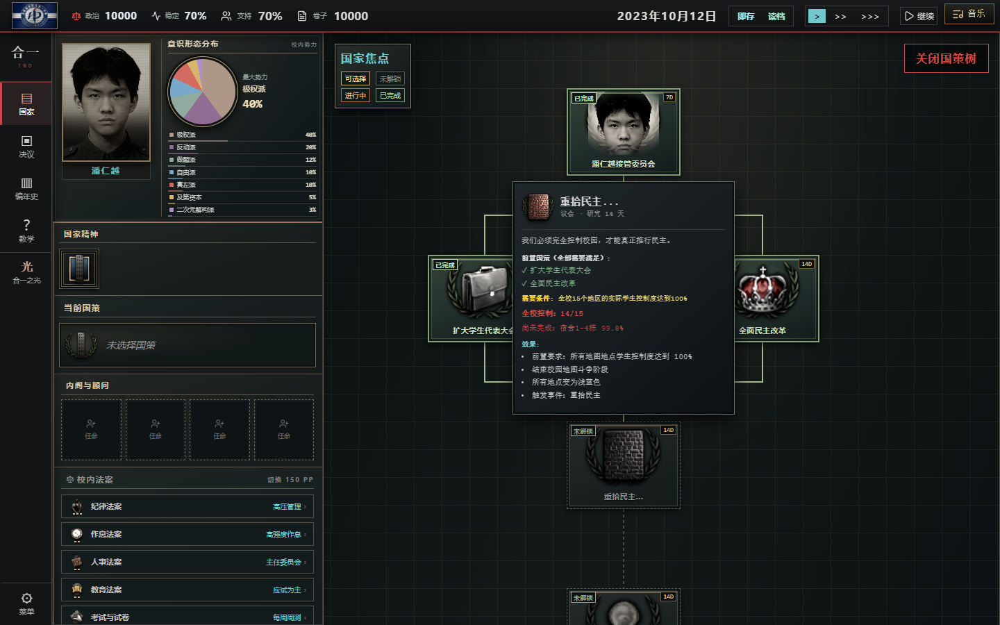

# 民主线地区交互与重拾民主修复

日期：2026-10-07。基线：`f26bb1d`。本批直接修改GitHub版，保护国策时长、原剧情和地区行动费用。

## 故障原因

1. 地图使用 `Math.round` 显示百分比，国策用实际地块值判断。例如宿舍控制99.8%会显示100%，但「重拾民主」仍未解锁。建筑平均值满格也不能代替15个子地区全部达标。
2. 地区手动按钮根据旧阶段旗标显示，工作组的可选行动又按另一套顺序判定。换线时保留的题改、清洗、旧教务等旗标可能抢占民主路线的操作权限。
3. 旧路线工作组通常要等下一游戏日才撤回。在换线事件暂停期间，它们仍占用名额，界面也会显示旧驻点。
4. 部分地区的防御天数在同一天被两处结算重复扣减；和平后的旧渗透分支仍可能继续执行。另有一处把四舍五入后的建筑100%当成对子地区的占满保护。

## 定向修复

- `mapState.ts` 提供共用的地图阶段、地块控制、建筑真实均值和全校进度读取。当前路线优先于其他路线的历史旗标；民主绝望阶段恢复地区斗争权限。
- 地图百分比保留必要的小数，只有真正满格才显示100%。仅容纳小于 `1e-7` 的浮点误差，不降低正常占领门槛。
- 「重拾民主」与真左「宣告全校夺取胜利」共用同一套15地区达标判定。国策悬浮窗显示已完成地区数和仍未达标的地区、实际百分比；吴线地区条件也使用同一控制读取。
- 手动按钮、工作组选择与执行共用可用行动名单。非法或过期按钮不再显示；当前路线不会被历史的其他路线地图旗标劫持。
- 换线、结束地区斗争、解锁选举或地区授权用尽后，失效工作组立即撤回并释放名额，不额外扣费。资源不足只暂缓合法任务。读档也清理过期驻点，撤回报告不重复。
- 完全没有地块数据的旧建筑制存档按建筑数据恢复；现代稀疏存档仍保留未写入地块的原始默认值，不凭建筑平均数虚构全校占领。
- 保留原每日结算流程；只修防御重复计时、满格地区保护和和平后渗透。原未设防地区的压力、邻接收益及行动奖励公式保留。

## 验收

`npm run check` 完整通过：103项测试、TypeScript、379个本地资源引用和Linux文件大小写、生产构建。生产包335个文件，约113.6MiB；原有大包体警告仍存在。

新增回归在 `tests/democracyMap.test.ts`，覆盖真实百分比、民主/真左国策、跨路线历史旗标、暂停状态下撤回、资源不足、阶段变更、旧存档和全校行动。

隔离无头Edge实测通过，页面脚本异常0：

| 场景 | 实际结果 |
| --- | --- |
| 宿舍99.8%，其余14区100% | 地图显示99.8%，国策显示14/15和缺少的地区 |
| 手动增强控制 | 按原价15PP扣除，补到真实100%，正常选择14天「重拾民主」 |
| 民主线工作组自动占领 | 两次原地区行动后补满，其他已占满地区保持100% |
| 重拾民主结束 | 原事件正常出现，结束地区斗争并撤回过期占领任务 |
| 再塑合一结束 | 原事件与普选站正常解锁，所有建筑有民调数据 |
| 选前手动/工作组拉票 | 两种方式都改变当地民调，旧夺取按钮不再出现 |
| 7天防御推进1天 | 剩6天，受保护地块控制不下降 |
| 未设防宿舍50%推进1天、邻接不足 | 按原压力降到49.2% |
| 和平阶段低控制地块推进1天 | 不再受到旧渗透分支攻击 |
| 真左全校胜利 | 原7天国策正常可选 |

试玩从原开始菜单进入并跳过教程，之后通过独立测试存档固定场景；原国策选择由真实UI操作，验证结束事件时把已选国策推进到最后一天。环境随机事务在测试页固定，不修改游戏源码或玩家浏览器存档。

## 实施边界

原本考虑替换整段每日地图结算，自动审批因潜在跨路线平衡影响拒绝该方案。最终采用以上局部修复，未接入通用国策/事件数值转换器，未重构主循环，未修改剧情文本或国策时长。
